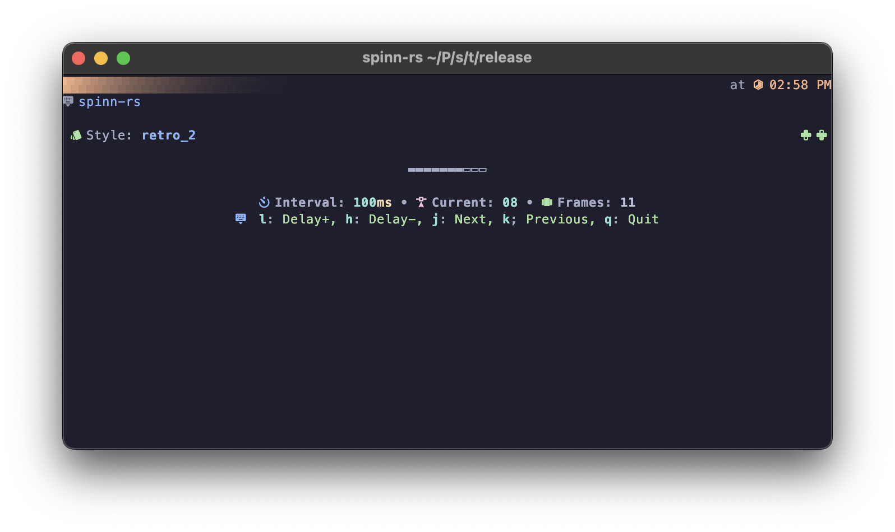
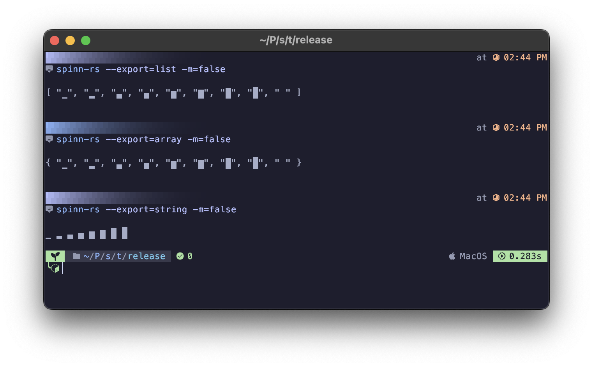

# 🍃 Spinn-rs

https://github.com/user-attachments/assets/fd921e48-fdfe-441d-bada-ebf83a419e6c




Spinn-rs(Spinners) is a simple rust project for navigating, exporting and playing TUI loading animations(also called spinners).

## ⭐ Features

- Ability to load custom spinners from `JSON`(see [spinners.json](https://github.com/OXY2DEV/spinn-rs/blob/main/spinners.json)).
- Simple UI to navigate between spinners.
- Allows changing animation speed when previewing spinners.
- Allows exporting spinners as `List`, `Array` or `String`.
- Allows changing quotes used in when exporting as `List` and `Array`.
- Allows both single-line & multi-line exports.

## 📦 Usage

1. Clone the repository to your machine.
2. Go inside the project directory/folder.
3. Run `cargo run`.

>[!TIP]
> You can use `cargo run -- -h` for viewing all the flags, export formats etc..

## 🧩 Commands

```txt
Usage: spinn-rs <spinner_name> <args>

Arguments:

  --export=<as>           Export format. See Expprt options.
  --help                  Shows this message.
  --interval=<ms>         Interval between each frame in miliseconds.
  --multiline=<bool>      Whether to export the output in multiple lines.
  --quote=<char>          Text to use for quoting strings when exporting.
  --source=<path>         Path to a JSON file containing spinners.
      
  -e=<as>                 Alias for --export.
  -h                      Alias for --help.
  -i=<ms>                 Alias for --interval.
  -m=<bool>               Alias for --multiline.
  -q=<char>               Alias for --quote.
  -s=<path>               Alias for --source.

Export options:

  array                   { "a", "b", "c" }
  list                    [ "a", "b", "c" ]
  string                  a b c
                          
  a                       Alias for 'array'
  l                       Alias for 'list'
  s                       Alias for 'string'
```

